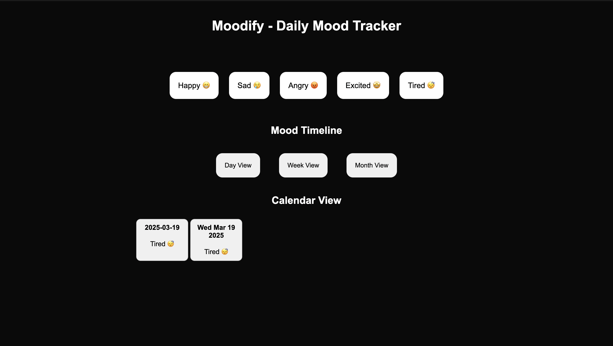

# Moodify - Daily Mood Tracker

## Application Features:

-   A daily mood tracker application to track the mood of the user.
-   User can click on the button which reciprocates their mood for the day.
-   The output is displayed in the calendar view after the user clicks the mood button.
-   The user can also select the mood timeline in which the output is to be displayed like day/week/month.
-   The data input by the user is stored in the localStorage of the browser.

## Screenshots:

## Deployment Link:

https://moodify-xi.vercel.app/
